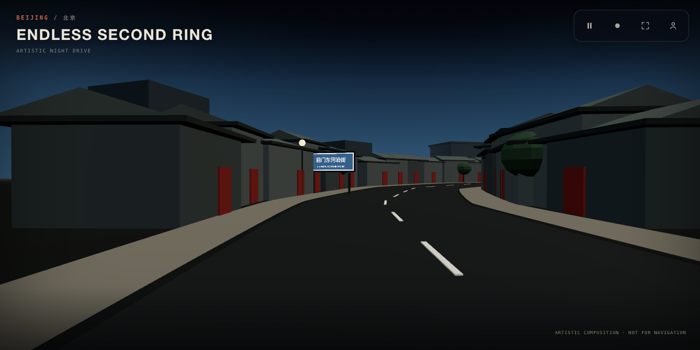

# Yupeng Lu

Backend / AI Platform Engineer focused on agent infrastructure, tool-using chat agents, realtime interview systems, and reliable LLM streaming.

San Francisco Bay Area. US permanent resident; no sponsorship required. Open to AI Agent, Applied AI, Backend Platform, and Developer Tools roles.

**🌐 Homepage → [brickerp.github.io](https://brickerp.github.io/)**

*Backdrop of my homepage: [BEIJING / 北京 — ENDLESS SECOND RING](https://brickerp.github.io/) — an artistic first-person Beijing night drive at driver-eye height, looping a seamless 48-second closed journey across twelve authored passages (Three.js + TypeScript). Artistic composition, not for navigation.*

## What I Build

- Agent workflows with typed tool contracts, scoped tool registries, structured outputs, and eval/QA gates.
- Backend platforms across TypeScript/Node.js, Python async services, PostgreSQL, Redis, Kafka/NATS, and AWS.
- Realtime and streaming systems: SSE, WebSocket, LiveKit, heartbeats, abort cleanup, trace context, and production observability.
- Product-grade full-stack systems where API contracts, state, UI, deployment, and regression coverage all need to line up.

## Work Worth Opening First

- [AI Usage Report](https://github.com/BrickerP/ai-usage-report) / [live report](https://brickerp.github.io/ai-usage-report/) - interactive GitHub Pages report for local AI coding usage across Codex, Claude Code, and Cursor.
- [Cookiy user-research skill](https://github.com/cookiy-ai/user-research-skill) - public AI-agent skill for end-to-end user research workflows with 100+ stars.
- [Cookiy CLI](https://github.com/cookiy-ai/cookiy-cli) - TypeScript CLI for AI interviews, synthetic users, quant surveys, participant recruitment, and agent-friendly research operations.
- Quant trading platform - private Python system for US stock minute-level momentum research and live execution, with IBKR, Polygon, S3 Parquet, factor scans, dashboarding, and broker-safety checks.
- GetDateLove - private production PWA built with FastAPI, Redis asyncio, PostgreSQL, WebSocket messaging, S3 voice notes, AWS deploy, PayPal checkout, and security/GDPR controls.

## Recent Engineering Themes

- Contract-first agent/API platforms: Zod/OpenAPI/MCP-style schemas, runtime validation, DTO alignment, and backward-compatible public API surfaces.
- Tool-using chat agents: report/study chat tools, transcript and screener grounding, direct-save edits, locked-fact guards, heartbeat streams, and tool-only response tolerance.
- Realtime interview reliability: LiveKit room/session state, transcript identity, avatar/video integration surfaces, playback contracts, and release-safe E2E gates.
- Data and trading systems: async pipelines, vectorized factor paths, S3 Parquet warehouse design, broker reconcile flows, and operational dashboards.

## Stack

TypeScript, Node.js, Python, FastAPI, NestJS, Prisma, Zod, PostgreSQL, Redis, Kafka, NATS, SSE, WebSocket, LiveKit, AWS, Docker, Kubernetes, GitHub Actions, OpenTelemetry, Prometheus, Grafana.

Private contributions are enabled on this profile, so part of the contribution graph reflects private production and research work without exposing private repository contents.
