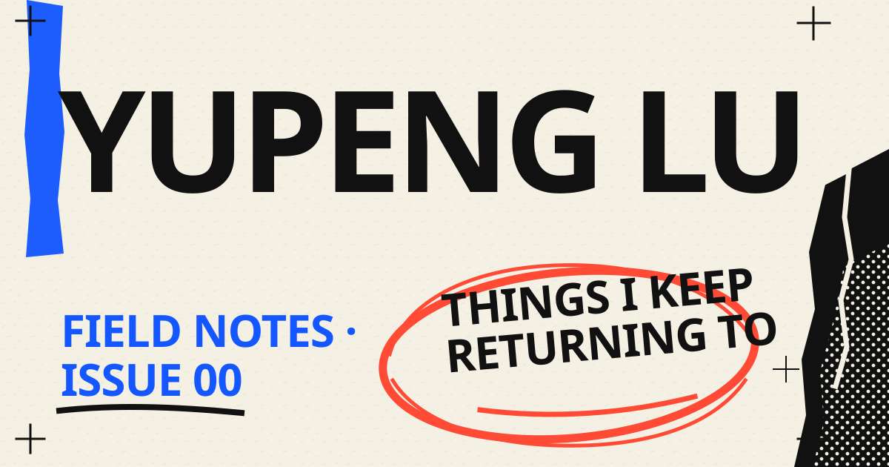
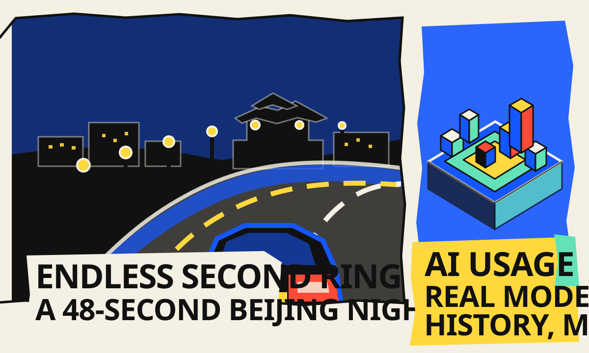
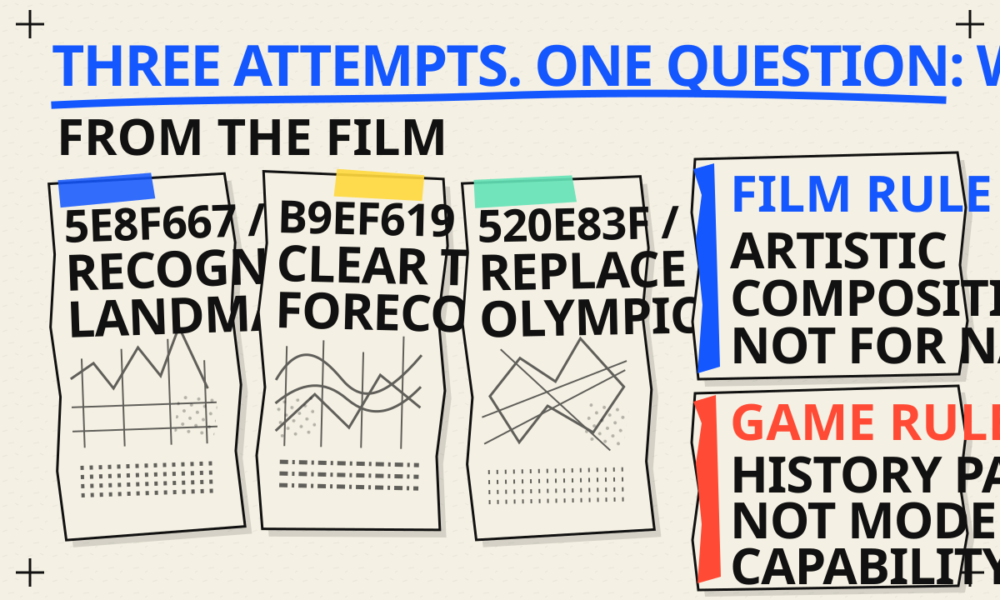

[WATCH FILM →](https://brickerp.github.io/) · [PLAY ARCHIVE →](https://brickerp.github.io/ai-usage-report/)

[EMAIL YUPENG →](mailto:yplmicro@gmail.com) · [RESUME →](https://brickerp.github.io/resume.pdf) · [GITHUB →](https://github.com/BrickerP)
