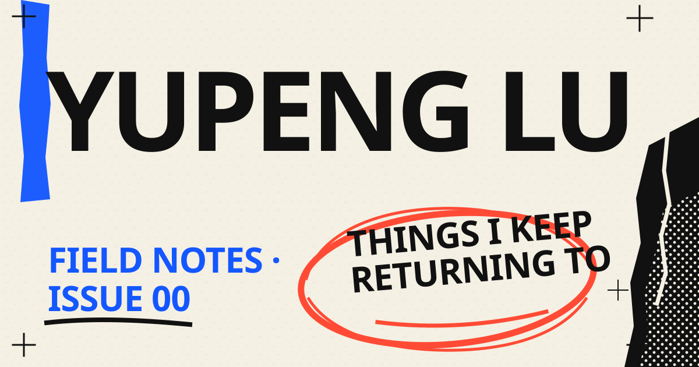
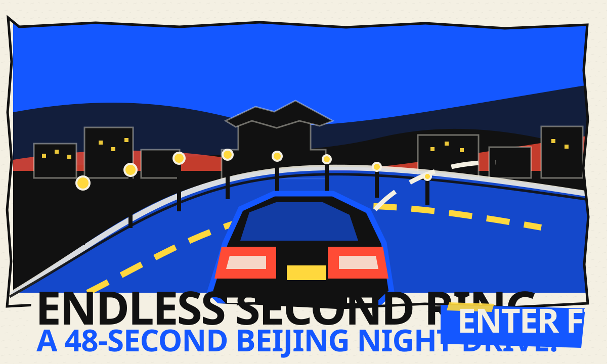
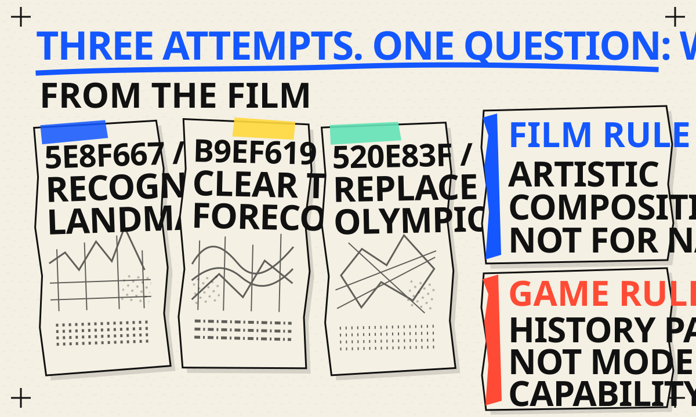

# Yupeng Lu

**Backend Engineer — live trading systems & AI platforms**

I build live systems and publish the numbers: trading execution on Alpaca, agent platforms at Baidu, and a deterministic 48-second WebGL film with CI performance gates.

- **Live trading execution** — Alpaca bracket orders → shared SQLite execution ledger (fill-dedupe keys, broker + DB startup reconcile) → S3 Parquet → an immutable public dashboard. On 2026-10-08 traced a scan-batch p95 regression (~2.4 s → ~9.2 s) to a 5-minute backfill cron holding SQLite's write lock; removed 2026-10-09, post-fix re-measure pending. → [Technical sheet № 01](https://brickerp.github.io/work/quant/) · [Live dashboard](https://d2c9pzwpavuktk.cloudfront.net/)
- **AI agent platforms at Baidu (MeDo)** — agent-native infra access (coding-agent skill + CLI), release-proof guardrails, Stripe billing-service extraction, 600+ merged changes across 19 repos. → [Resume](https://brickerp.github.io/resume)
- **Beijing Infinite Loop** — deterministic 48-second Three.js film with CI performance and seam gates. → [brickerp.github.io](https://brickerp.github.io/) · [About](https://brickerp.github.io/about/)

[Resume](https://brickerp.github.io/resume) · [Email](mailto:yplmicro@gmail.com) · [LinkedIn](https://linkedin.com/in/yupeng-lu-845a0b411)

