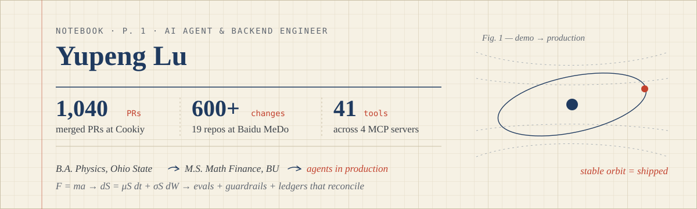
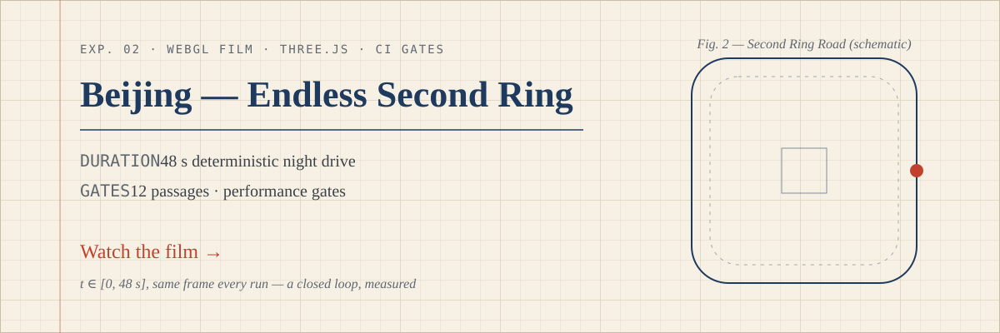

# Yupeng Lu

**AI agent & backend engineer — I take agents from demo to production: MCP tools, guardrails, evals, billing, real-time systems.**

Part-time / contract · ~20 h/week · Diamond Bar, California (PT) · US permanent resident · [yplmicro@gmail.com](mailto:yplmicro@gmail.com) · [Contact](https://brickerp.github.io/#contact)

### Proof

- **Technical sheet № 01** — [sheet](https://brickerp.github.io/work/quant/) · [live dashboard](https://d2c9pzwpavuktk.cloudfront.net/) · production real-time system on AWS (Strategy and P&L stay private)
- **Cookiy AI** — [cookiy-cli](https://www.npmjs.com/package/cookiy-cli) · [cookiy-mcp](https://www.npmjs.com/package/cookiy-mcp) · 41 tools across 4 MCP servers, 1,040 merged PRs
- **Baidu · MeDo** — [resume](https://brickerp.github.io/resume.pdf) · 600+ merged changes across 19 repos; Stripe billing 40/40 tables, 0 errors
- **open-ledger** — [live demo](https://open-ledger.brickerp.workers.dev) · verifiable append-only ledger on Cloudflare Workers

